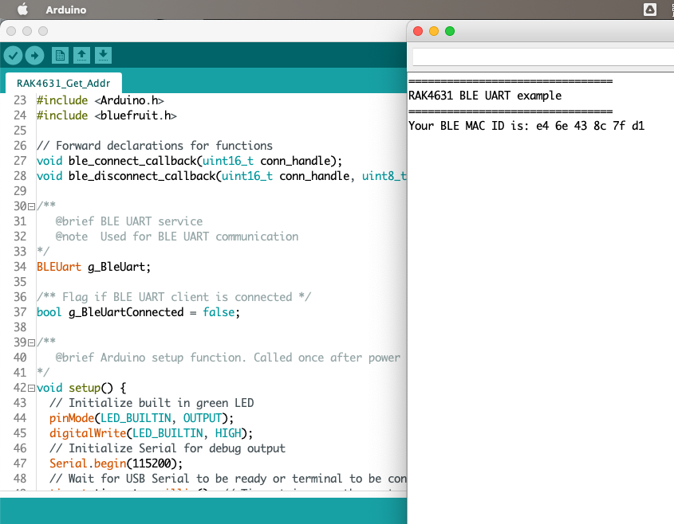
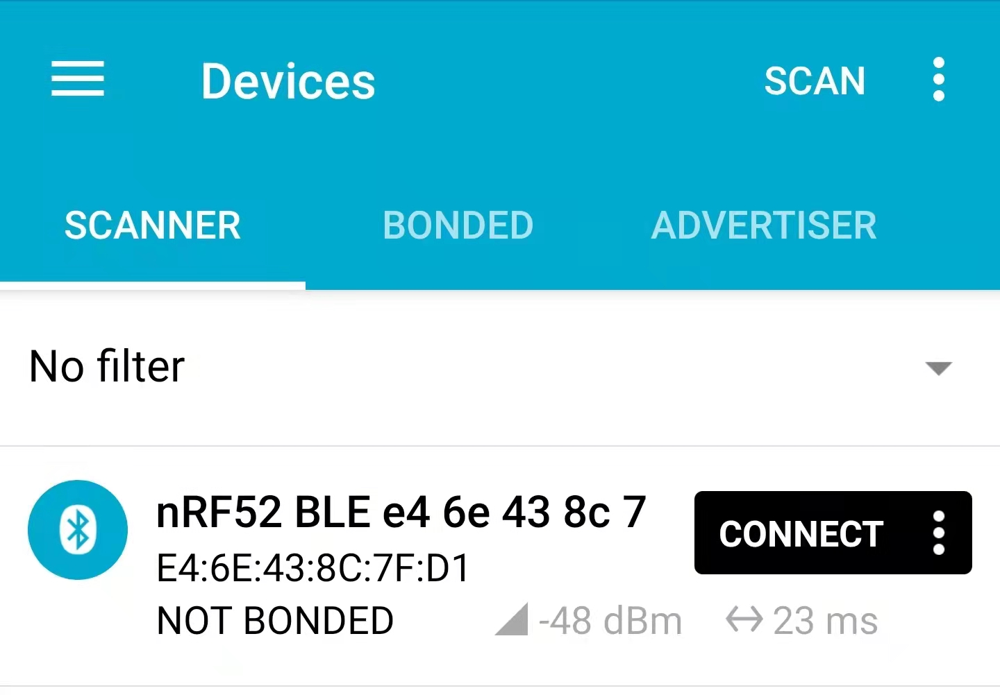

# RAK4631_Get_Addr

Small update to the Wisblock RAK4631 [ble_uart.ino example](https://github.com/RAKWireless/WisBlock/blob/master/examples/RAK4630/communications/BLE/ble_uart/ble_uart.ino): it fetches the MAC address, prints it out on the Serial console, and sets the device's name to "nRF52 BLE xx xx xx xx xx xx".

An already compiled firmware is provided, which you can flash with the `install.sh` bash script. Works on Mac, probably requires adjustments for other platforms.

